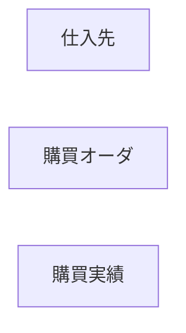

# シンプル＆超効率的な 鳥瞰データモデリング図ルール
## ＋ Codex 向け 超詳細実装手順

このドキュメントは、Codex が **鳥瞰データモデル図を自動生成するツール**を実装するための
・ルール定義  
・データ構造  
・アルゴリズム  
を具体的に示す。

最終的な目標は：

1. 入力（YAML/JSON またはコード内定義）から  
2. 座標計算済みの内部モデルを作り  
3. Mermaid / Draw.io XML / SVG などの図表形式を出力する

ことである。

---

## 0. 全体アーキテクチャ

Codex が生成するプログラムは、概ね次のステップを踏む：

1. **入力パース**：YAML/JSON で書かれた鳥瞰モデル定義を読み込む
2. **検証**：ルール違反がないかチェックする
3. **レイアウト計算**：レーン位置とエンティティ（箱）の座標を計算する
4. **フロー（矢印）のルーティング**：直交線での始点・終点を決定する
5. **出力生成**：Mermaid / Draw.io XML / SVG 等の形式に変換する
6. **オプション**：PNG 等へのレンダリング（別ツール利用を前提）

各ステップの詳細を以下に定義する。

---

## 1. 入力仕様（YAML/JSON）

### 1.1 共通構造

Codex は次のスキーマに従った YAML/JSON を扱う。

```yaml
meta:
  title: "○○社 鳥瞰データモデル"
  version: "v1.0"
  created_at: "2025-01-01"
  author: "Takemura"
  scope: "国内拠点のみ / EC未含"

lanes:
  - id: "procurement"
    title: "購買"
  - id: "production"
    title: "生産"
  - id: "sales"
    title: "販売"
  - id: "accounting"
    title: "会計"

entities:
  - id: "vendor"
    label: "仕入先"
    lane: "procurement"
    layer: 1     # 1:マスタ, 2:計画, 3:実績
    type: "master"
  - id: "purchase_order"
    label: "購買オーダ"
    lane: "procurement"
    layer: 2
    type: "plan"
  - id: "purchase_result"
    label: "購買実績"
    lane: "procurement"
    layer: 3
    type: "transaction"

flows:
  - from: "purchase_order"
    to: "purchase_result"
    type: "generate"  # generate | reference
````

### 1.2 type と色のマッピング

```yaml
color_map:
  master: "#F6CED8"       # ピンク系
  plan: "#FFF5A5"         # 黄色系
  transaction: "#CFE2F3"  # 水色系
```

Codex は `entities[*].type` を必ず `color_map` にマッピングする。

---

## 2. 検証ロジック（Validation）

Codex は入力を受けたら、まず次の検証を行う。

1. **必須フィールドの存在チェック**

   * `meta`, `lanes`, `entities` が存在するか
   * 各 `lane` に `id`, `title` があるか
   * 各 `entity` に `id`, `label`, `lane`, `layer`, `type` があるか
2. **参照整合性**

   * すべての `entity.lane` が `lanes.id` に存在するか
   * すべての `flows.from` / `flows.to` が `entities.id` に存在するか
3. **レイヤー値の妥当性**

   * `layer` は 1, 2, 3 のいずれかであること
4. **レーン内の箱数制約**

   * 各 `lane` について、`entities` の数が 7 を超えた場合は警告を出す（エラーにはしない）
5. **名前の簡易ルール**

   * `label` にテーブル名っぽいパターン（`T_`, `_HDR` など）が含まれていたら警告

実装イメージ（擬似コード）：

```python
def validate(model):
    assert "lanes" in model and "entities" in model
    lane_ids = {lane["id"] for lane in model["lanes"]}
    entity_ids = {e["id"] for e in model["entities"]}

    for e in model["entities"]:
        assert e["lane"] in lane_ids
        assert e["layer"] in [1, 2, 3]
        assert e["type"] in model["color_map"]

    for f in model.get("flows", []):
        assert f["from"] in entity_ids
        assert f["to"] in entity_ids
```

---

## 3. レイアウト計算（座標決定アルゴリズム）

### 3.1 基本パラメータ

Codex は固定のレイアウトパラメータを持つ：

```python
LANE_WIDTH = 260        # レーンの幅
LANE_MARGIN_X = 40      # 左右マージン
LANE_MARGIN_Y = 40      # 上部マージン
LANE_GAP_X = 40         # レーン間の横方向ギャップ

ENTITY_WIDTH = 160      # 箱の幅
ENTITY_HEIGHT = 40      # 箱の高さ
ENTITY_GAP_Y = 24       # 同一レイヤー内の縦方向ギャップ

LAYER_OFFSET_Y = 40     # レーンの上端から layer=1 までのオフセット
LAYER_HEIGHT = 120      # レイヤー間の高さ（layer=1→2、2→3）
```

### 3.2 レーンの座標計算

レーン i の左上座標を次で計算する：

```python
for index, lane in enumerate(lanes):
    lane.x = LANE_MARGIN_X + index * (LANE_WIDTH + LANE_GAP_X)
    lane.y = LANE_MARGIN_Y
    lane.width = LANE_WIDTH
    lane.height = estimate_lane_height()  # 最大 layer × LAYER_HEIGHT + 余白
```

`estimate_lane_height()` は全レーン共通で、`3 * LAYER_HEIGHT + 2 * LAYER_OFFSET_Y` など固定値でよい。

### 3.3 エンティティ（箱）の座標計算

1. `entities` を `(lane, layer)` ごとにグループ化する。
2. 同じ `(lane, layer)` の中で、**縦方向に並べる**（x is same, y is increasing）。

擬似コード：

```python
grouped = {}  # key: (lane_id, layer) -> list[entity]
for e in entities:
    grouped.setdefault((e["lane"], e["layer"]), []).append(e)

for (lane_id, layer), ents in grouped.items():
    lane = lane_by_id[lane_id]
    # layer の基準 Y 座標
    base_y = lane.y + LAYER_OFFSET_Y + (layer - 1) * LAYER_HEIGHT

    for idx, e in enumerate(ents):
        e.x = lane.x + (lane.width - ENTITY_WIDTH) / 2
        e.y = base_y + idx * (ENTITY_HEIGHT + ENTITY_GAP_Y)
        e.width = ENTITY_WIDTH
        e.height = ENTITY_HEIGHT
```

---

## 4. フロー（矢印）のルーティング

### 4.1 始点・終点の基本方針

* **同一レーン内**でのフロー
  → 基本的に上側箱から下側箱へ向かう。
  → 始点：下側の辺中央、終点：上側の辺中央。

* **異なるレーン間**でのフロー
  → 左のレーンから右のレーンへ向かう。
  → 始点：右辺中央、終点：左辺中央。

Codex は `from_entity` と `to_entity` の座標を使って、始点・終点を決定する。

擬似コード：

```python
def compute_flow_points(flow, entities_by_id, lanes_by_id):
    src = entities_by_id[flow["from"]]
    dst = entities_by_id[flow["to"]]

    same_lane = src["lane"] == dst["lane"]

    if same_lane:
        if src["y"] < dst["y"]:
            # src が上、dst が下
            start = (src["x"] + src["width"] / 2, src["y"] + src["height"])
            end   = (dst["x"] + dst["width"] / 2, dst["y"])
        else:
            # src が下、dst が上（例外的ケース）
            start = (src["x"] + src["width"] / 2, src["y"])
            end   = (dst["x"] + dst["width"] / 2, dst["y"] + dst["height"])
    else:
        # lane の x 位置で左右を判断
        if src["x"] < dst["x"]:
            # 左→右
            start = (src["x"] + src["width"], src["y"] + src["height"] / 2)
            end   = (dst["x"], dst["y"] + dst["height"] / 2)
        else:
            # 右→左（あまり推奨しない）
            start = (src["x"], src["y"] + src["height"] / 2)
            end   = (dst["x"] + dst["width"], dst["y"] + dst["height"] / 2)

    flow["start"] = start
    flow["end"] = end
```

### 4.2 直交線への変換

Draw.io 用などで「角付き直線（直交）」にする場合：

1. `start` と `end` を結ぶための中継点（waypoint）を追加する。
2. 基本ルール：

   * 水平 → 垂直 → 水平、の順になる 2〜3 点を追加する。

例：レーン間（左→右）の場合：

```python
mid_x = (start.x + end.x) / 2
points = [
  start,
  (mid_x, start.y),  # 水平に移動
  (mid_x, end.y),    # 垂直に移動
  end
]
flow["points"] = points
```

この `points` 情報を Draw.io の `mxGeometry` の `Array` として持たせる。

---

## 5. 出力生成

### 5.1 Mermaid 出力

Mermaid では座標制御は限定的だが、
**業務の流れ説明用途**であれば簡易的に以下のように出力する：

#### 5.1.1 ノード定義



#### 5.1.2 エッジ定義

```mermaid
    purchase_order --> purchase_result
```

#### 5.1.3 クラス定義（色指定）

```mermaid
classDef master fill:#F6CED8,stroke:#333,stroke-width:1px;
classDef plan fill:#FFF5A5,stroke:#333,stroke-width:1px;
classDef transaction fill:#CFE2F3,stroke:#333,stroke-width:1px;

class vendor master;
class purchase_order plan;
class purchase_result transaction;
```

Codex は `entities` と `flows` を順に走査して上記形式の文字列を構築する。

---

### 5.2 Draw.io XML 出力（簡易版）

1. ルート：`<mxGraphModel>` を作成
2. それぞれのエンティティごとに `<mxCell>` を生成：

```xml
<mxCell id="vendor" value="仕入先" style="rounded=1;fillColor=#F6CED8;strokeColor=#333;" vertex="1" parent="1">
  <mxGeometry x="100" y="80" width="160" height="40" as="geometry" />
</mxCell>
```

3. フロー用 `<mxCell>` を生成：

```xml
<mxCell id="flow1" edge="1" parent="1" source="purchase_order" target="purchase_result"
        style="edgeStyle=orthogonalEdgeStyle;rounded=0;endArrow=block;">
  <mxGeometry relative="1" as="geometry">
    <Array as="points">
      <mxPoint x="..." y="..." />
      <mxPoint x="..." y="..." />
    </Array>
  </mxGeometry>
</mxCell>
```

Codex は前項の `flow["points"]` を `mxPoint` に展開する。

---

### 5.3 SVG 出力（超簡易版）

独自に SVG を生成する場合：

1. `<svg width="..." height="...">` を作成
2. 各エンティティを `<rect> + <text>` の組で出力
3. 各フローを `<path>` または `<polyline>` で出力

   * `points` 情報を `"x1,y1 x2,y2 x3,y3 ..."` 形式に連結

擬似コード：

```python
def render_svg(model):
    # 1. svg ヘッダ
    # 2. for each entity: rect + text
    # 3. for each flow: polyline
```

---

## 6. 出力前の自己チェック（Codex 側）

処理の最後に、Codex は以下を必ずチェックする：

* 座標がマイナス値になっていないか
* フローの `start`/`end` がエンティティ領域外になっていないか
* JSON / XML / Mermaid の文法エラーがないか
* レーン順・レイヤー順がルールどおりに並んでいるか

---

## 7. 参考：最小動作するサンプル

最終的に Codex は、以下のようなフローのコードを生成できること：

1. YAML 読込 → Python dict に変換
2. `validate(model)` を実行
3. `layout_lanes(model)`, `layout_entities(model)` で座標計算
4. `compute_flow_points(model)` でフローのポイントを計算
5. `render_mermaid(model)` または `render_drawio_xml(model)` を呼び出し
6. 文字列としてファイルに書き出す

---

以上が、Codex がそのまま実装に落とせるレベルまで詳細化した
「シンプル＆超効率的な鳥瞰データモデリング図」の実装手順である。

```

---
